    

  
<h1>
    
 Hi there, 👋 I'm Danidu Muhandiram 

    

        <!--  -->
    

 
    

        <!-- Social & Contact Badges -->
<!-- Top Badges Row -->

    
    
    
    
    

<!-- WakaTime Badges Row -->

    
    

    

   
    

</h1>

    <em>
        Hello! I'm <b>Danidu Muhandiram</b>, a passionate <b>self-learner</b> and <b>undergraduate</b> student at SLIIT Campus, Sri Lanka. 
        Fascinated by <b>software development</b> and always eager to explore <b>new technologies</b>
        <!-- . 
        Constantly seeking opportunities to <b>grow and expand my skills</b> -->
        
    </em>
      
    

        <h3><b><i>"Simple things should be simple. Complex things should be possible."</i></b></h3>
    

<h2><em>About Me</em></h2>

<ul>
  <li>😄 Pronouns: He/Him</li>
  <li>🌱 Currently learning <b>Python</b></li>
  <li>🧠 Strong interest in <b>Artificial Intelligence & Machine Learning</b></li>
  <li>🤝 Open to collaborating on open-source projects</li>
  <li>🎨 Contributor at <b>Adobe Stock & Zedge</b></li>
</ul>

<h2><em>Languages & Tools</em></h2>

  

<h2><em>GitHub Stats</em></h2>

    <!---->
    
    

 

<h2><em>Live Projects</em></h2>

These tools and web applications are live and may help with your daily tasks.

<h3>Live Tools</h3>

| Tool | Description | Repo | Live |
|------|-------------|------|------|
| Keyword Translator | Translate keywords in batches, refine them with tag-based editing, and copy results instantly |  |  |
| UniTimetable | Convert the official SLIIT FET-generated timetable into a clean, colorful, and student friendly version - in just one click |  |  |
| ImageMatch | Desktop overlay image viewer for fast, manual similarity checks while browsing stock sites or working in any application. |  |  |
<!--| QR Code Generator | Under |  |  |-->

<h3>Live Web Applications</h3>

| App | Description | Repo | Live |
|-----|-------------|------|------|
| Palo | Accounting Firm Website |  |  |
| NOIR ATLAS | My personal online art gallery where I share a curated collection of original AI-generated artworks and illustrations |  |  |
